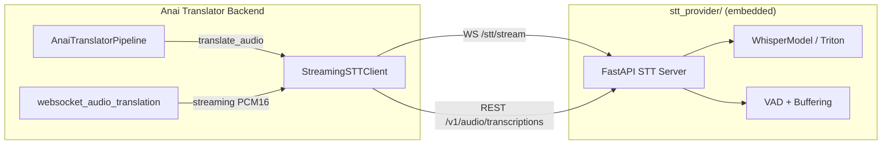

# Integration Plan: True Streaming STT Provider → Anai Translator

## Objective

Copy the `true-streaming-stt-provider` project into the translator repo as `stt_provider/` and wire it as the translator's STT backend, replacing the direct `faster-whisper` dependency with the streaming STT service's WebSocket + REST APIs.

## Architecture



The translator talks to the STT provider **via HTTP/WebSocket** (using the existing Python SDK). The STT provider runs as the same process or a separate service — the client is agnostic.

## Step-by-step Plan

### 1. Copy `true-streaming-stt-provider` into the repo

- Copy `C:\Users\nrldc\OneDrive\Desktop\New folder (3)\true-streaming-stt-provider\` → `universal-translator/stt_provider/`
- Exclude: `.git/`, `.pytest_cache/`, `__pycache__/`, `dataset/`, `.env` (keep `.env.example`)
- This mirrors the pattern used for `naia/` integration

### 2. Copy the Python SDK into the backend

- Copy `stt_provider/sdk/python/true_streaming_stt/` → `backend/stt_client/`
- This gives the translator backend a clean import: `from backend.stt_client import StreamingSTTClient, STTEvent`

### 3. Add STT provider config to `backend/config.py`

New environment variables:
- `STT_PROVIDER` — `"local"` (default, direct faster-whisper) or `"streaming"` (use the STT provider service)
- `STT_PROVIDER_URL` — base URL of the STT provider (default: `http://127.0.0.1:8002`)
- `STT_PROVIDER_WS_URL` — WebSocket URL (default: `ws://127.0.0.1:8002/stt/stream`)
- `STT_PROVIDER_API_KEY` — API key for the STT provider

Add accessor functions:
- `get_stt_provider()` → returns `"local"` or `"streaming"`
- `get_stt_provider_url()` → URL string
- `get_stt_provider_ws_url()` → WS URL string
- `get_stt_provider_api_key()` → API key string

### 4. Create `backend/stt_bridge.py` — adapter between pipeline and STT provider

This module provides a unified `transcribe()` interface that:
- When `STT_PROVIDER=local`: delegates to existing `WhisperSpeechToText` (no change)
- When `STT_PROVIDER=streaming`: uses `StreamingSTTClient.transcribe_file()` for batch, and `StreamingSTTClient.stream_pcm16()` for live

### 5. Modify `backend/pipeline.py` — use the STT bridge

- Replace `self.stt` (type `WhisperSpeechToText`) with the bridge
- `translate_audio()` calls the bridge's `transcribe()` method
- The bridge decides local vs streaming based on config

### 6. Modify `backend/streaming.py` — use STT provider for live audio

In `websocket_audio_translation()`:
- When `STT_PROVIDER=streaming`: proxy the browser's PCM16 audio directly to the STT provider's WebSocket (`/stt/stream`), receive `transcript.partial` and `transcript.final` events, then feed those into the existing translation pipeline
- When `STT_PROVIDER=local`: keep current behavior (Silero VAD → Whisper batch)

### 7. Add STT provider env vars to `.env.example`

New section:
```
# STT Provider
STT_PROVIDER=local
STT_PROVIDER_URL=http://127.0.0.1:8002
STT_PROVIDER_WS_URL=ws://127.0.0.1:8002/stt/stream
STT_PROVIDER_API_KEY=
```

### 8. Update `stt_provider/.env.example` to use port 8002

Change default port from 8000 to 8002 to avoid conflict with the translator backend on 8000.

### 9. Add `stt_provider/` to `.gitignore`

Same pattern as `naia/` — prevent committing large artifacts.

### 10. Wire STT provider health into `/ready` endpoint

In `backend/api.py`, when `STT_PROVIDER=streaming`, the `/ready` endpoint also checks the STT provider's `/health` endpoint and reports its status.

## Files Changed

| File | Change |
|------|--------|
| `stt_provider/` (new directory) | Full copy of the STT provider project |
| `backend/stt_client/` (new directory) | Copy of the Python SDK |
| `backend/stt_bridge.py` (new file) | Adapter: local vs streaming STT |
| `backend/config.py` | Add 4 new config functions + env vars |
| `backend/pipeline.py` | Use stt_bridge instead of direct WhisperSpeechToText |
| `backend/streaming.py` | Add streaming STT WebSocket path |
| `backend/api.py` | Check STT provider health in /ready |
| `.env.example` | Add STT_PROVIDER section |
| `.gitignore` | Add stt_provider/ exclusions |
| `stt_provider/.env.example` | Change port to 8002 |

## Verification

1. `python -m compileall .` — no syntax errors across entire repo
2. `python -c "from backend.stt_bridge import ..."` — imports work
3. `python -c "from backend.stt_client import StreamingSTTClient, STTEvent"` — SDK imports work
4. Start translator backend with `STT_PROVIDER=local` — everything works as before
5. Start STT provider on port 8002, set `STT_PROVIDER=streaming` — translator uses the provider
6. `GET /ready` reports STT provider status when configured
7. Frontend build still passes
8. Mobile lint still passes
